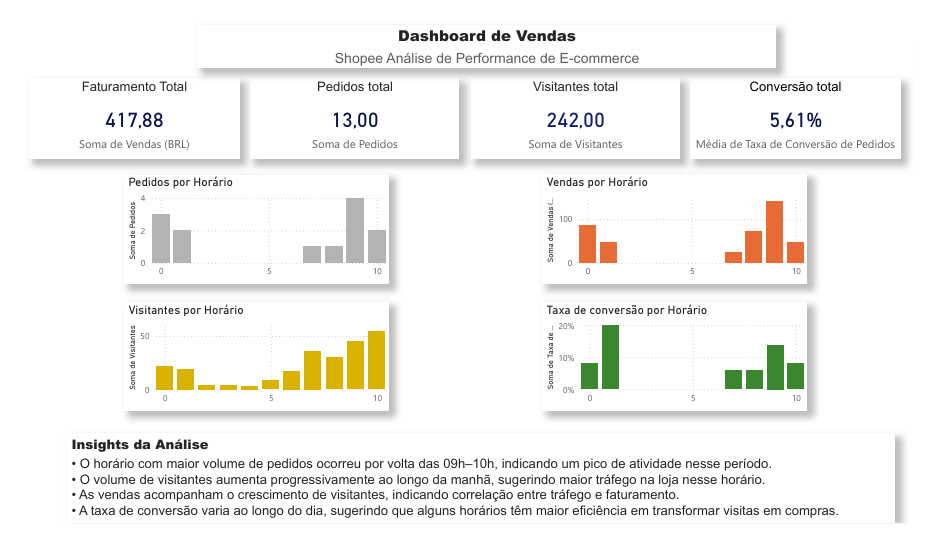
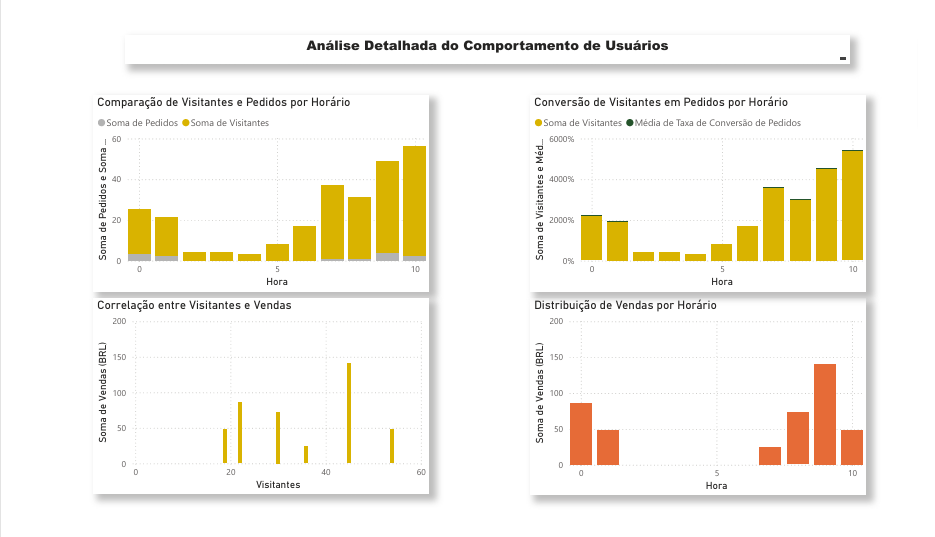

# analise-vendas-ecommerce-powerbi

Projeto de análise de dados de vendas de e-commerce utilizando Power BI.

## Dashboard Geral

## Análise por Horário

## Ferramentas utilizadas

- Power BI
- Excel
- Análise de dados

## Métricas analisadas

- Faturamento total
- Pedidos
- Visitantes
- Taxa de conversão
- Vendas por horário
